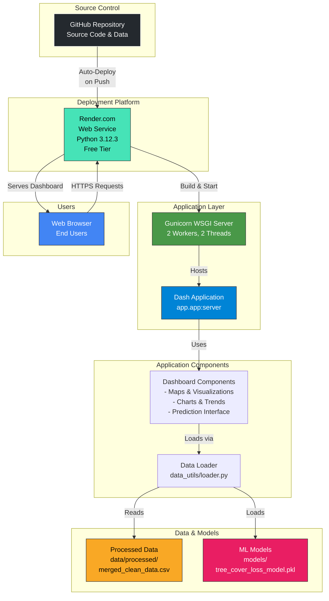
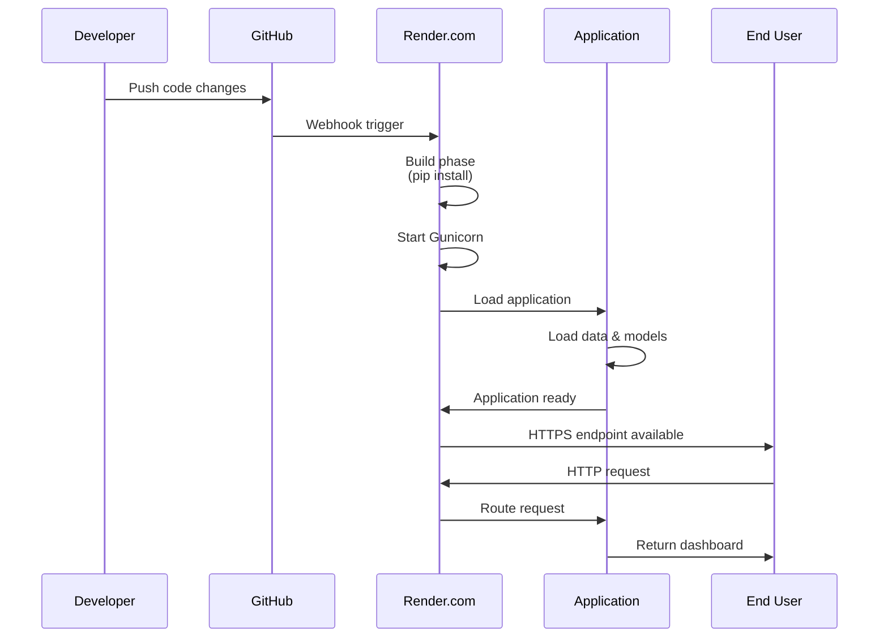

# Deployment Architecture Diagram
## Forest Watch Dashboard - GitHub to Render.com

This document provides a visual representation of the deployment architecture for the Forest Watch Dashboard application.

## System Architecture



## Component Details

### 1. GitHub Repository
- **Purpose**: Version control and source code hosting
- **Contents**:
  - Application code (`app/`)
  - Data files (`data/`)
  - Trained models (`models/`)
  - Configuration files (`render.yaml`, `requirements.txt`)
  - Documentation (`reports/`, `README.md`)

### 2. Render.com Platform
- **Service Type**: Web Service
- **Runtime**: Python 3.12.3
- **Plan**: Free Tier
- **Configuration**: Defined in `render.yaml`
- **Features**:
  - Automatic deployments on Git push
  - HTTPS/SSL certificates
  - Health monitoring
  - Environment variable management

### 3. Gunicorn WSGI Server
- **Role**: Application server
- **Configuration**:
  - Workers: 2
  - Threads per worker: 2
  - Timeout: 120 seconds
  - Bind: `0.0.0.0:$PORT`
- **Purpose**: Handles HTTP requests and manages worker processes

### 4. Dash Application
- **Framework**: Dash (Plotly)
- **Entry Point**: `app.app:server`
- **Features**:
  - Interactive web dashboard
  - Real-time data visualization
  - ML-powered predictions
  - Multi-tab interface

### 5. Application Components
- **Summary Cards**: Key statistics display
- **Map View**: Interactive global forest loss maps
- **Loss Trends**: Time series visualizations
- **Drivers Chart**: Deforestation driver analysis
- **Emissions Chart**: Carbon impact visualization
- **Prediction Box**: ML model predictions interface

### 6. Data Loader Module
- **Location**: `app/data_utils/loader.py`
- **Functions**:
  - Loads processed CSV data
  - Loads trained ML models
  - Performs data cleaning
  - Calculates summary statistics

### 7. Data Storage
- **Processed Data**: `data/processed/merged_clean_data.csv`
  - Contains forest loss data (2001-2024)
  - Preprocessed and cleaned
- **ML Models**: `models/tree_cover_loss_model.pkl`
  - Serialized XGBoost model
  - Includes feature metadata
  - Ready for inference

## Deployment Workflow



## Technology Stack

| Component | Technology | Version |
|-----------|-----------|---------|
| Runtime | Python | 3.12.3 |
| Web Framework | Dash | ≥2.14.0 |
| WSGI Server | Gunicorn | ≥21.2.0 |
| Visualization | Plotly | ≥5.18.0 |
| ML Framework | scikit-learn | ≥1.4.0 |
| ML Algorithm | XGBoost | ≥2.0.3 |
| Data Processing | Pandas | ≥2.2.6 |
| Model Serialization | joblib | ≥1.3.0 |

## Configuration Files

### render.yaml
```yaml
services:
  - type: web
    name: forest-restoration-dashboard
    runtime: python
    plan: free
    buildCommand: pip install -r requirements.txt
    startCommand: gunicorn --bind 0.0.0.0:$PORT --workers 2 --threads 2 --timeout 120 --pythonpath . app.app:server
    envVars:
      - key: PYTHON_VERSION
        value: 3.12.3
    healthCheckPath: /
```

## Security & Performance

- **HTTPS**: Automatic SSL/TLS encryption via Render
- **Health Checks**: Automatic monitoring of service availability
- **Resource Management**: 2 workers with 2 threads each for concurrent request handling
- **Timeout Protection**: 120-second timeout prevents hanging requests
- **Data Privacy**: All data processed server-side, no client-side data storage

## Scalability Considerations

- **Current**: Free tier suitable for low to moderate traffic
- **Upgrade Path**: Can scale to paid tiers for:
  - Higher traffic volumes
  - More workers/threads
  - Increased memory/CPU
  - Custom domains
  - Database integration (if needed)

## Monitoring & Maintenance

- **Deployment Status**: Visible in Render dashboard
- **Logs**: Accessible via Render interface
- **Health Endpoint**: `/` path monitored automatically
- **Error Tracking**: Application logs available for debugging


